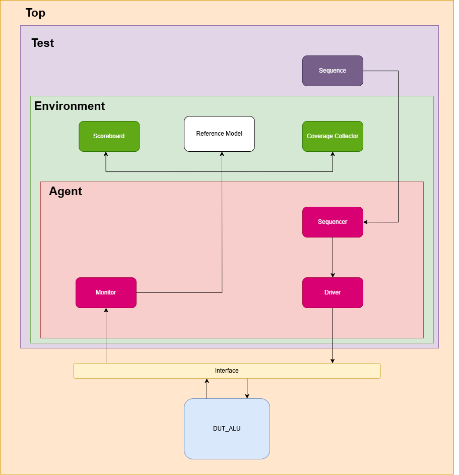

<!DOCTYPE html>
<html lang="en">
<head>
  <meta charset="UTF-8">
  <meta name="viewport" content="width=device-width, initial-scale=1.0">
  <!-- <title>ALU Verification Assignment</title>
  
</head> -->
<body>

<h1>ALU Verification Assignment</h1>
<h3>Submitted to: Eng. Nour ElDeen ElHout</h3>
<h4>By: Amira Atef, Aya El Desouky and Mohamed Ayman</h4>

<h4>Table of Contents</h4>
</body>
</html>

1. [Signal Definition](#signal-definition)
2. [Verification Environment Architecture](#verification-environment-architecture)
3. [Wave Diagrams](#wave-diagrams)
4. [Verification Plan](#verification-plan)
5. [QuestaSim Waveforms](#questasim-waveforms)
6. [Code Coverage Report](#code-coverage-report)
7. [Functional Coverage Report](#functional-coverage-report)
8. [Assertions](#assertions)
___
#### Signal Definition
| Name      | Direction | Length | Description |
| --------  | --------  | ------ | ------ |
| clk       | input     | 1 bit  | Clock |
| reset     | input     | 1 bit  | Active low async. reset|
| valid_in  | input     | 1 bit  | validate input signals|
| a         | input     | 4 bits | port A |
| b         | input     | 4 bits | port B |
| cin       | input     | 1 bit  |  carry in |
| ctl       | input     | 4 bits |  opcodes |
| valid_out | output    | 1 bit  |  validate input signals |
| alu       | output    | 4 bits |  alu output |
| carry     | output    | 1 bit  |  carry out |
| zero      | output    | 1 bit  |  zero flag output |
___

#### Verification Environment Architecture

___

#### Wave Diagrams
___
#### Verification Plan
| Label           | Description                                                                                                                                      | Stimulus Generation                                                                                                                                            | Functional Coverage                                                                                                                        | Functionality Check                                           |
|-----------------|--------------------------------------------------------------------------------------------------------------------------------------------------|----------------------------------------------------------------------------------------------------------------------------------------------------------------|--------------------------------------------------------------------------------------------------------------------------------------------|---------------------------------------------------------------|
| ALU_1           | When the reset is deasserted, the outputs values should be low.                                                                                  | Directed at the start of the simulation, then randomized with constraint that drive the reset to be off(high) most of the simulation time.                     | -                                                                                                                                          | A checker in the testbench to make sure the output is correct |
| ALU_2           | Verifying extreme values on a and b, with OPCODE = ADD, SUB, ADD_c or SUB_b.                                                                     | Randomization under constraints on the a and b signals to take values (MAX and ZERO) most of the simulation time.                                              | Covered the extreme values, the rest of the values and walking ones for both a and b. Covered the ADD, SUB, ADD_c and SUB_b opcode values. | A checker in the testbench to make sure the output is correct |
| ALU_3           | When OPCODE = 0 or 1 or 2 the operations are solely done on input b.                                                                             | Randomization under constraints on signal b to take values (MAX and ZERO) most of the simulation time.                                                         | Covered the SEL, INC and DEC opcode values.                                                                                                | A checker in the testbench to make sure the output is correct |
| ALU_4           | When OPCODE = AND, OR or XOR, the output out value must be the ANDing, ORing or XORing of a and b.                                               | Randomization under constraints on the input B most of the time to have one bit high in its 3 bits while constraining the A to be low.                         | Covered the AND, OR and XOR opcode values.                                                                                                 | A checker in the testbench to make sure the output is correct |
| ALU_5           | When OPCODE = SHIFT_L, SHIFT_R, ROTATE_L or ROTATE_R, the output value must be shifted or rotated accordingly.                                   | Randomization under constraints on the inputs a and b when opcode= shift or rotate, do not constraint the inputs a or b when the operation is shift or rotate. | Covered the SHIFT_L, SHIFT_R, ROTATE_L and ROTATE_R values for the opcode.                                                                 | A checker in the testbench to make sure the output is correct |
| ALU_6           | When OPCODE is != ADD, SUB, ADD_c or SUB_b, carry signal must be low.                                                                            | Randomization under constraints on the opcode to be anything but  ADD, SUB, ADD_c or SUB_b, do not constraint the inputs a or b.                               | Covered the SEL, INC, DEC, AND, OR, XOR, SHIFT_L, SHIFT_R, ROTATE_L and ROTATE_R values for the opcode.                                    | A checker in the testbench to make sure the output is correct |
| ALU_7           | When alu= 4'b0 and carry = 1'b0, zero flag should be 1.                                                                                          | Randomization                                                                                                                                                  | -                                                                                                                                          | A checker in the testbench to make sure the output is correct |
| CROSS 1         | a, b at ADD, SUB, ADD_c or SUB_b.                                                                                                                | Randomization                                                                                                                                                  | When the ALU is addition or subtraction, a and b should have taken all permutations of maxpos and zero.                                    | Output Checked against reference model.                       |
| CROSS 2         | cin                                                                                                                                              | Randomization                                                                                                                                                  | When the ALU is addition w/ carry or subtracition w/ carry, cin should have taken 0 or 1                                                   | Output Checked against reference model.                       |
| CROSS 3         | a, b at OR & XOR & AND                                                                                                                           | Randomization                                                                                                                                                  | When the ALU is AND, OR or XOR, then a and b take all walking one patterns (0001, 0010, 0100 and 1000).                                    | Output Checked against reference model.                       |
| CROSS 4         | a, b at OR & XOR & AND                                                                                                                           | Randomization                                                                                                                                                  | When the ALU is AND, OR or XOR, then a and b take all ones and all zeroz (0000 and 1111).                                                  | Output Checked against reference model.                       |
| Reference model | when the randomized inputs enter it, the output should be accurately equal to correct output of the design                                       | Randomization                                                                                                                                                  | -                                                                                                                                          | Output Checked against reference model.                       |
| check result    | when the expected values from the golden model are not equal to the outputs of the DUT, the error_count increased, else correct_count increased. | Randomization                                                                                                                                                  | -                                                                                                                                          | Output Checked against reference model.                       |                                            
___
#### QuestaSim Waveforms
___
####  Code Coverage Report
<!-- | File Name | Line Coverage | Branch Coverage | Condition Coverage | Toggle Coverage | Decision Coverage | MC
|-----------|---------------|----------------|---------------------|----------------|------------------|-----|
| alu.sv    | 100%          | 100%           | 100%  -->
___
####  Functional Coverage Report
___
#### Assertions
___
