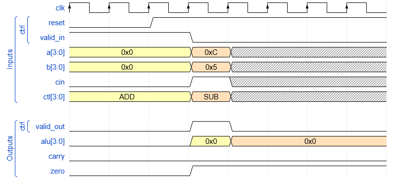

<!DOCTYPE html>
<html lang="en">
<head>
  <meta charset="UTF-8">
  <meta name="viewport" content="width=devicSir"> 
  <title>ALU Verification Assignment</title>
  
</head>
<body>

  

  <h1>ALU Verification Assignment</h1>
  <h3>Submitted to: Eng. Nour ElDeen ElHout</h3>
  <h4>By: Amira Atef, Aya El Desouky and Mohamed Ayman</h4>
  

  <!-- Notes Section -->
  

    <strong><em>Note</em></strong>
    
This repo doesn't verify the shift and rotate operations due to the purpose of their exact functions being unclear.

    
Two files are included:

    <ul>
      <li><b>ALU_1</b>: Verifies the ALU design in one testbench file.</li>
      <li><b>ALU_2</b>: Contains the testbench done using the SV Architecture.</li>
    </ul>
  

  <h4>Table of Contents</h4>

</body>
</html>

1. [**Signals Definition**](#signals-definition)
2. [**ALU Operations**](#alu-operations)
3. [**Verification Environment Architecture**](#verification-environment-architecture)
4. [**Wave Diagrams**](#wave-diagrams)
5. [**Verification Plan**](#verification-plan)
6. [**QuestaSim Transcript Output**](#questasim-transcript-output)
7. [**QuestaSim Waveforms and Discovered Bugs**](#questasim-waveforms-and-discovered-bugs)
8. [Bug 1 (SUB Operation):](#bug-1-sub-operation)
9. [Bug 2 (SUB w/ Borrow Operation):](#bug-2-sub-w-borrow-operation)
10. [Bug 3 (SEL Operation):](#bug-3-sel-operation)
11. [Bug 4 (Valid out value in case of XOR  Operation):](#bug-4-valid-out-value-in-case-of-xor--operation)
12. [Bug 5 (INVALID Operations):](#bug-5-invalid-operations)
13. [Bug 6 (Zero Flag Value):](#bug-6-zero-flag-value)
14. [**Code Coverage Report**](#code-coverage-report)
15. [Statement Coverage](#statement-coverage)
16. [Branch Coverage](#branch-coverage)
17. [Toggle Coverage](#toggle-coverage)
18. [**Functional Coverage Report**](#functional-coverage-report)
19. [**Assertions and Cover Directives**](#assertions-and-cover-directives)
___
#### **Signals Definition**
| Name      | Direction | Length | Description |
| --------  | --------  | ------ | ------ |
| clk       | input     | 1 bit  | Clock |
| reset     | input     | 1 bit  | Active low async. reset|
| valid_in  | input     | 1 bit  | validate input signals|
| a         | input     | 4 bits | port A |
| b         | input     | 4 bits | port B |
| cin       | input     | 1 bit  |  carry in |
| ctl       | input     | 4 bits |  opcodes |
| valid_out | output    | 1 bit  |  validate input signals |
| alu       | output    | 4 bits |  alu output |
| carry     | output    | 1 bit  |  carry out |
| zero      | output    | 1 bit  |  zero flag output |
___

#### **ALU Operations**
|  |
|:--:|
| *Figure 1: ALU Operations* |
___

#### **Verification Environment Architecture**
|  |
|:--:|
| *Figure 2: Verification Arichitecture* |
___

#### **Wave Diagrams**
|  |
|:--:|
| *Figure 3: Reset* |

|  |
|:--:|
| *Figure 4: Valid_in* |

|  |
|:--:|
| *Figure 5: ALU Operations* |

___
#### **Verification Plan**
| Label           | Description                                                                                                                                      | Stimulus Generation                                                                                                                                            | Functional Coverage                                                                                                                        | Functionality Check                                           |
|-----------------|--------------------------------------------------------------------------------------------------------------------------------------------------|----------------------------------------------------------------------------------------------------------------------------------------------------------------|--------------------------------------------------------------------------------------------------------------------------------------------|---------------------------------------------------------------|
| ALU_1           | When the reset is deasserted, the outputs values should be low.                                                                                  | Directed at the start of the simulation, then randomized with constraint that drive the reset to be off(high) most of the simulation time.                     | -                                                                                                                                          | A checker in the testbench to make sure the output is correct |
| ALU_2           | Verifying extreme values on a and b, with OPCODE = ADD, SUB, ADD_c or SUB_b.                                                                     | Randomization under constraints on the a and b signals to take values (MAX and ZERO) most of the simulation time.                                              | Covered the extreme values, the rest of the values and walking ones for both a and b. Covered the ADD, SUB, ADD_c and SUB_b opcode values. | A checker in the testbench to make sure the output is correct |
| ALU_3           | When OPCODE = 0 or 1 or 2 the operations are solely done on input b.                                                                             | Randomization under constraints on signal b to take values (MAX and ZERO) most of the simulation time.                                                         | Covered the SEL, INC and DEC opcode values.                                                                                                | A checker in the testbench to make sure the output is correct |
| ALU_4           | When OPCODE = AND, OR or XOR, the output out value must be the ANDing, ORing or XORing of a and b.                                               | Randomization under constraints on the input B most of the time to have one bit high in its 3 bits while constraining the A to be low.                         | Covered the AND, OR and XOR opcode values.                                                                                                 | A checker in the testbench to make sure the output is correct |
| ALU_5           | When OPCODE = SHIFT_L, SHIFT_R, ROTATE_L or ROTATE_R, the output value must be shifted or rotated accordingly.                                   | Randomization under constraints on the inputs a and b when opcode= shift or rotate, do not constraint the inputs a or b when the operation is shift or rotate. | Covered the SHIFT_L, SHIFT_R, ROTATE_L and ROTATE_R values for the opcode.                                                                 | A checker in the testbench to make sure the output is correct |
| ALU_6           | When OPCODE is != ADD, SUB, ADD_c or SUB_b, carry signal must be low.                                                                            | Randomization under constraints on the opcode to be anything but  ADD, SUB, ADD_c or SUB_b, do not constraint the inputs a or b.                               | Covered the SEL, INC, DEC, AND, OR, XOR, SHIFT_L, SHIFT_R, ROTATE_L and ROTATE_R values for the opcode.                                    | A checker in the testbench to make sure the output is correct |
| ALU_7           | When alu= 4'b0 and carry = 1'b0, zero flag should be 1.                                                                                          | Randomization                                                                                                                                                  | -                                                                                                                                          | A checker in the testbench to make sure the output is correct |
| ALU_8           | When Valid_in = 0, input is not valid, so output values don’t change and valid_out = 0.                                                                                         | Randomization                                                                                                                                                  | Covering valid inputs and outputs.                                                                                                                                         | A checker in the testbench to make sure the output is correct |
| ALU_9           | When Valid_in = 1, input is valid, so output values adjust and valid_out = 1.                                                                                      | Randomization                                                                                                                                                  | Covering valid inputs and outputs.                                                                                                                                          | A checker in the testbench to make sure the output is correct |
| ALU_10           | When OPCODE = 14 or 15. output stays the same and valid_out = 0.                                                                                          | Randomization                                                                                                                                                  | Covering ctl values that aren't opcodes.                                                                                                                                          | A checker in the testbench to make sure the output is correct |
| CROSS 1         | a, b at ADD, SUB, ADD_c or SUB_b.                                                                                                                | Randomization                                                                                                                                                  | When the ALU is addition or subtraction, a and b should have taken all permutations of maxpos and zero.                                    | Output Checked against reference model.                       |
| CROSS 2         | cin                                                                                                                                              | Randomization                                                                                                                                                  | When the ALU is addition w/ carry or subtracition w/ carry, cin should have taken 0 or 1                                                   | Output Checked against reference model.                       |
| CROSS 3         | a, b at OR & XOR & AND                                                                                                                           | Randomization                                                                                                                                                  | When the ALU is AND, OR or XOR, then a and b take all walking one patterns (0001, 0010, 0100 and 1000).                                    | Output Checked against reference model.                       |
| CROSS 4         | a, b at OR & XOR & AND                                                                                                                           | Randomization                                                                                                                                                  | When the ALU is AND, OR or XOR, then a and b take all ones and all zeroz (0000 and 1111).                                                  | Output Checked against reference model.                       |
| Reference model | when the randomized inputs enter it, the output should be accurately equal to correct output of the design                                       | Randomization                                                                                                                                                  | -                                                                                                                                          | Output Checked against reference model.                       |
| Check Result    | when the expected values from the golden model are not equal to the outputs of the DUT, the error_count increased, else correct_count increased. | Randomization                                                                                                                                                  | -                                                                                                                                          | Output Checked against reference model.                       |                                            
___
#### **QuestaSim Transcript Output**
|  |
|:--:|
| *Figure 6: Transcript* |
___
#### **QuestaSim Waveforms and Discovered Bugs**
#### Bug 1 (SUB Operation):
- We can see that when the SUB operation is performed between 11 and 5 as highlighted below, the golden module produces the correct result which is 6 while the ALU produces an incorrect result which is 7.
  
|  |
|:--:|
| *Figure 7: Waveform Snippet 1* |
___
#### Bug 2 (SUB w/ Borrow Operation):
-We can see that when the SUB with borrow operation is performed between 15 and 9 with cin = 0 as highlighted below, the golden module produces the correct result which is 6 while the ALU produces an incorrect result which is 5.
|  |
|:--:|
| *Figure 8: Waveform Snippet 2* |
___
#### Bug 3 (SEL Operation):
-We can see that when the SEL operation is performed with b = 10 as highlighted below, the golden module produces the correct result which is 10 (selects the value of b) while the ALU produces an incorrect result which is 7 (selects the value of a).
|  |
|:--:|
| *Figure 9: Waveform Snippet 3* |
___
#### Bug 4 (Valid out value in case of XOR  Operation):
- We can see that when the XOR operation is performed with a = 14 and b = 15 as highlighted below, BOTH the ALU and the golden module produce the correct result which is 1, however the value of the valid out in the ALU is 0 which is incorrect while the value of the valid out in the golden module is 1 which is correct.
  
|  |
|:--:|
| *Figure 10: Waveform Snippet 4* |
___
#### Bug 5 (INVALID Operations):
|  |
|:--:|
| *Figure 11: Waveform Snippet 5* |
___
#### Bug 6 (Zero Flag Value):
|  |
|:--:|
| *Figure 12: Waveform Snippet 6* |
___
####  **Code Coverage Report**
#### Statement Coverage

|  |
|:--:|
| *Figure 13: Statement Coverage* |
#### Branch Coverage
|  |
|:--:|
| *Figure 14: Branch Coverage* |
#### Toggle Coverage
|  |
|:--:|
| *Figure 15: Toggle Coverage* |
___
####  **Functional Coverage Report**

|  |
|:--:|
| *Figure 16: Functional Coverage Report* |
___
#### **Assertions and Cover Directives**
|  |
|:--:|
| *Figure 17: Assertions* |

|  |
|:--:|
| *Figure 18: Cover Directives* |
___
